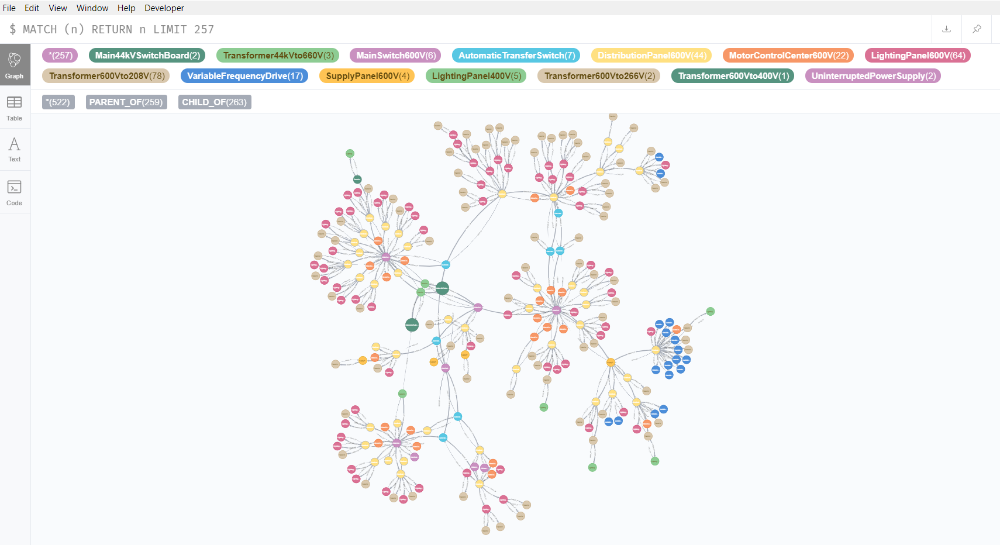
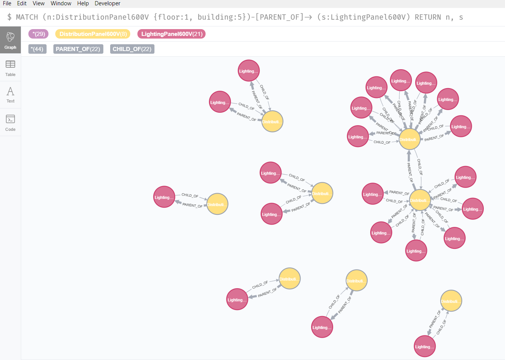
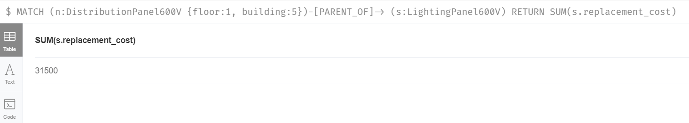
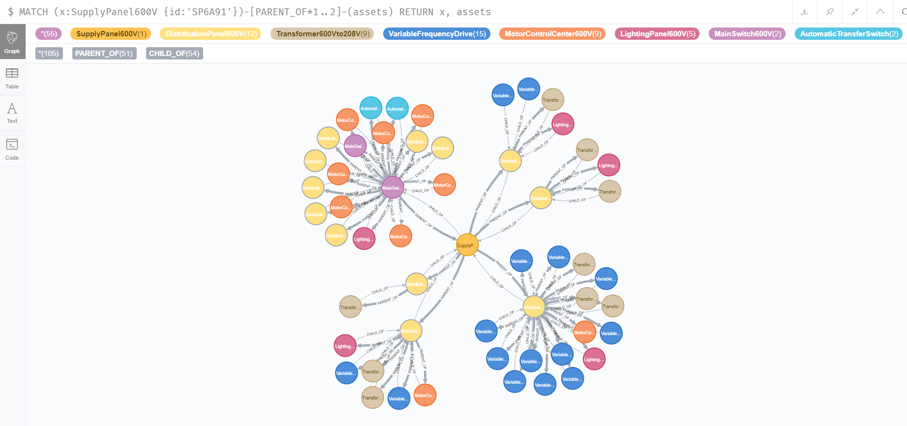
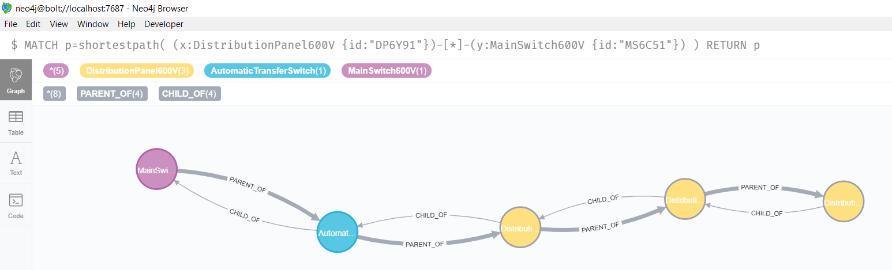
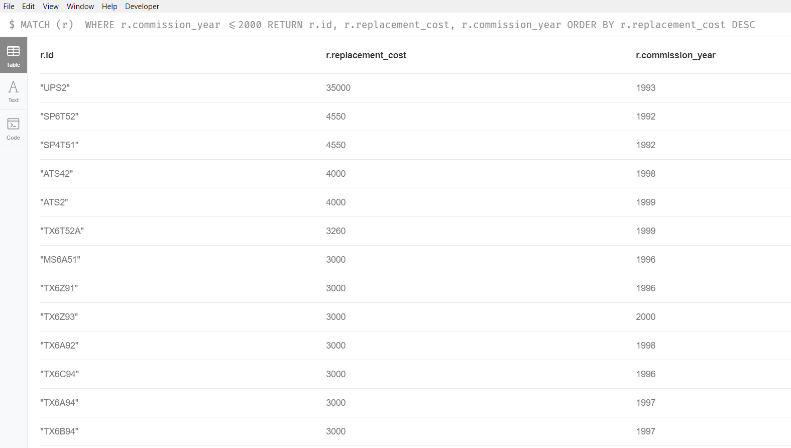
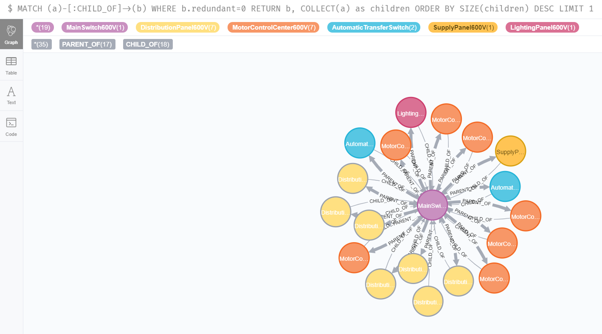

# Neo4j_GraphDB
My first project with Neo4j Graph DB

# Background
This was a project where I worked with dummy electrical data. If anyone knows anything about electrical schematics, they are hierarchical; which makes for a great Graph database project. The idea is that the graph created would be able to answer complicated questions from the maintenance department of any facility in regards to their electrical assets (e.g. panels, switches, transformers, etc.). I used Python to transform the data and write creation cyphers that I entered into Neo4j desktop (i.e. using computer as local server). 

# Graph

The following pic below is the full Graph that I created with over 250 assets all connected through PARENT_OF and CHILD_OF relationships.
Every node represents an electrical asset that is labeled and has properties such as location (building, floor), cost of replacement, criticality, commission_year, lifetime, redundancy (whether there is a backup asset).

 

## Sample Queries

#### 1. What are the Distribution panels in building 5 on the 1st floor of building 5 and all the 600V lighting panels associated with them? What will it cost to replace all the lighting panels?

Imagine there is a capital project to replace the lighting panels on a certain floor of a building. A simple query like this can help establish scope for project proposals and project planning.

 

#### 2. Give me all the assets 2 degrees of freedom away from a certain supply panel?

Imagine there is a breakdown or planned maintenance work for a given supply panel. A simple query like this can help assess impact quickly.

#### 3. What is the shortest path between assetX and assetY?

Imagine there was an issue with assetY and the only possible cause of that issue was due to assetX, a simple query like this can help establish scope of all the assets in between the 2 affected. 

#### 4. What are the most expensive assets to replace that were commissioned in 2000 or earlier?

Imagine there was a maintenance project to replace old equipment and prioritize them based on replacement cost.

#### 5. Which asset breakdown is the most impactful (i.e. has the most PARENT_OF relationships and has no redundancy)

This is a quick query to quickly get an electrical asset with the most connections (ie. has the most assets dependent on it) and does not have a back-up (no redundancy)

